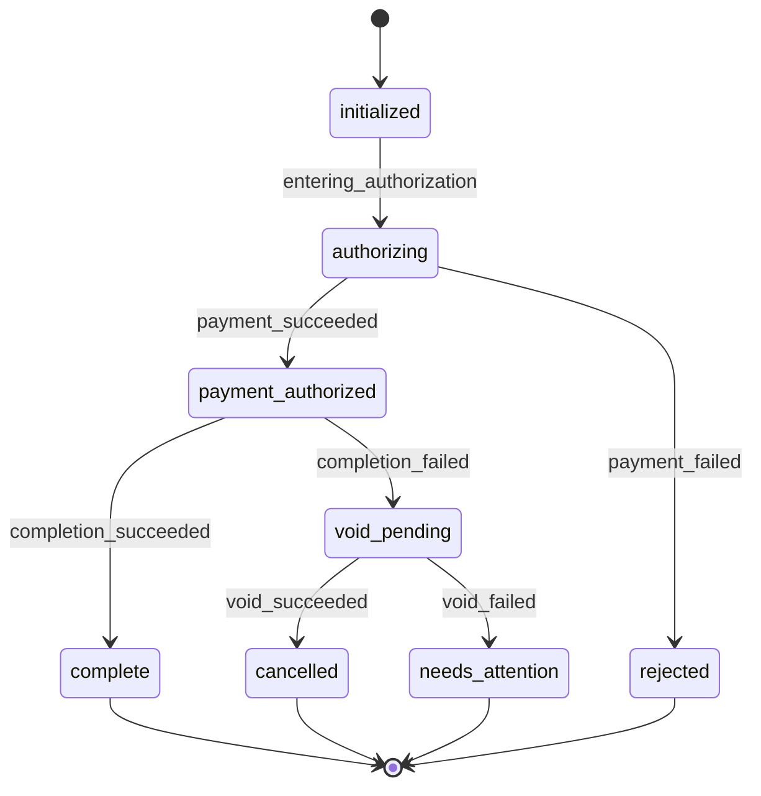

# Order State Machine

A checkout service that models an order through its lifecycle and recovers differently depending on where a failure happens.

## The problem

An order touches two external systems: a payment provider and a completion provider. Neither can participate in a local transaction, so when a later step fails there is nothing to roll back. There is only a compensating action.

A decline costs nothing to undo. A completion failure after authorization has to be compensated with a void. And a void that itself fails leaves the system somewhere it cannot resolve on its own and needs attention.

## The state machine



## Running it

Requires Go 1.22 or newer.

```
go run .
go test ./...
```

The server listens on `:8080`. Storage is in memory and resets on restart.

```
POST /orders                    create an order
POST /orders/{id}/transitions   advance it
GET  /orders/{id}               current state and history
```

### Walking the happy path

```bash
curl -X POST localhost:8080/orders \
  -H 'Content-Type: application/json' \
  -d '{"amount_cents": 5000}'

curl -X POST localhost:8080/orders/<id>/transitions \
  -H 'Content-Type: application/json' \
  -d '{"command": "authorize_payment"}'

curl -X POST localhost:8080/orders/<id>/transitions \
  -H 'Content-Type: application/json' \
  -d '{"command": "complete_order"}'

curl localhost:8080/orders/<id>
```

### Exercising the failure paths

The stubs are configured at startup by `SCENARIO`:

| SCENARIO | Outcome |
| --- | --- |
| unset or `happy` | `complete` |
| `decline` | `rejected` |
| `completion_failure` | `cancelled` |
| `void_failure` | `needs_attention` |

```bash
SCENARIO=void_failure go run .
```

Set `SCENARIO`, restart the server, then run the same three requests as above. Each restart clears the store, so create a new order after switching.

Under `void_failure` the final `GET` returns:

```json
{
    "id": "c3cd6235c83cad5d5ec3b17d6a5ca75a",
    "amount_cents": 5000,
    "current_state": "needs_attention",
    "history": [
        {
            "state": "initialized",
            "timestamp": "2026-08-23T09:42:43.6554832-04:00"
        },
        {
            "state": "authorizing",
            "timestamp": "2026-08-23T09:42:43.6554901-04:00"
        },
        {
            "state": "payment_authorized",
            "timestamp": "2026-08-23T09:43:21.7231206-04:00"
        },
        {
            "state": "void_pending",
            "timestamp": "2026-08-23T09:43:28.7997450-04:00",
            "reason": "order completion failed"
        },
        {
            "state": "needs_attention",
            "timestamp": "2026-08-23T09:43:28.7997450-04:00",
            "reason": "void failed at provider"
        }
    ]
}
```

## Commands and events

Clients send **commands**, not events. The service performs the operation and derives the resulting **event** from what the provider returned.

```
{"command": "authorize_payment"}
{"command": "complete_order"}
```

Events, all internal:

* `entering_authorization`
* `payment_succeeded`
* `payment_failed`
* `completion_succeeded`
* `completion_failed`
* `void_succeeded`
* `void_failed`

## Structure

```
models/      states, events, transition table, order
storage/     in-memory store
payment/     payment stub
completion/  completion stub
api/         handlers, and the interfaces they depend on
```

## Testing

`api/handler_test.go` covers the four scenarios end to end with stubs injected per case: happy path, payment decline, completion failure with a successful void, and completion failure with a failed void.

`models/order_test.go` covers the state machine in isolation, and `storage/store_test.go` covers the conditional write.

`TestConcurrentAuthorizeChargesOnce` runs twenty simultaneous `authorize_payment` calls against one order and asserts the provider is reached once. It holds every caller inside `GetOrder` until all of them have read, so the stale-read interleaving is guaranteed rather than hoped for.

## Tradeoffs and what I'd do next

**Synchronous model.** Every provider outcome is known immediately. Real authorization is asynchronous, so `initialized` is really a state awaiting a callback that may be duplicated, delayed, or lost. That needs pending states, idempotency keys, a timeout sweeper, and reconciliation against the provider before deciding an order failed.

**Read modify write is only atomic on one path.** `authorize_payment` claims the order into `authorizing` with a conditional write, so two concurrent calls cannot both reach the payment provider. `complete_order` has no such guard: it reads, mutates and writes back with the store lock released in between, so two concurrent calls could both read `payment_authorized` and both reach the completion provider. `SaveIfStateIs` is the tool for it; applying it there is the next step.

**An order can get stuck in `authorizing`.** If the process dies between the claim and the provider result, nothing moves the order out and every later command rejects it. It needs a timeout sweeper that reconciles against the provider before deciding what the order should become. Note that such a sweeper also makes the unconditional write at the end of `authorizePayment` unsafe, and that write would have to become conditional too.

**No operational surface.** Nothing lists the orders sitting in `needs_attention`, which makes a state that requires manual resolution useless in practice. It needs a filtered query and alerting on queue depth.